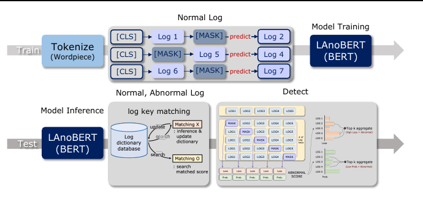
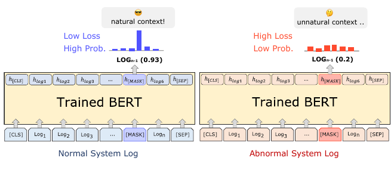
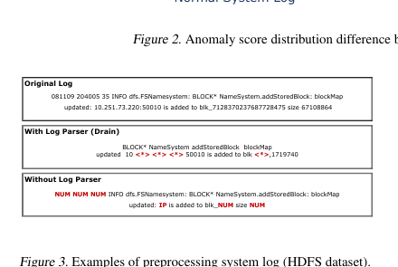
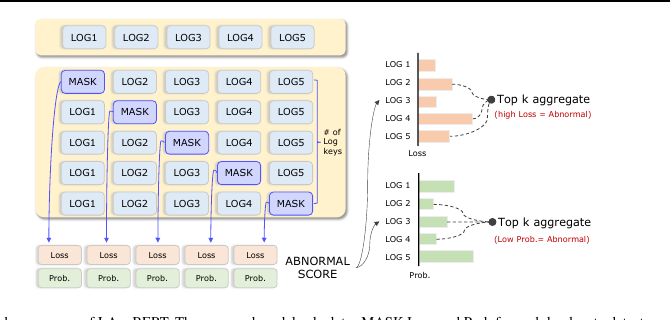
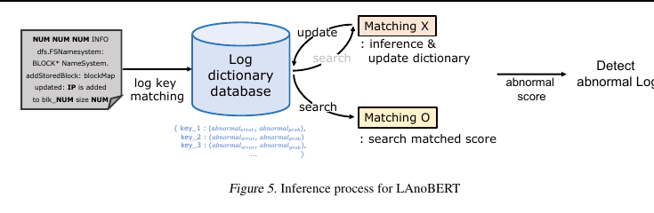
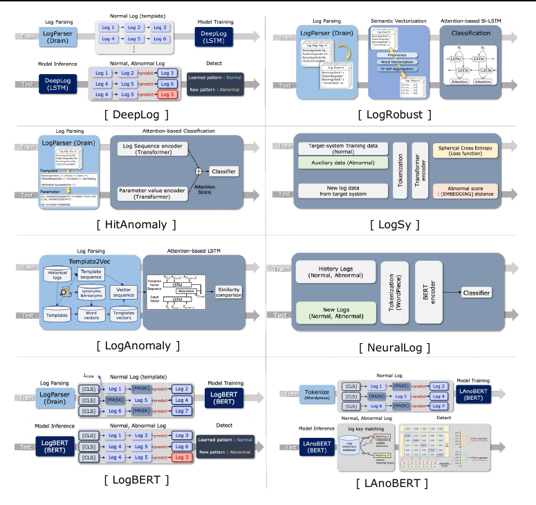
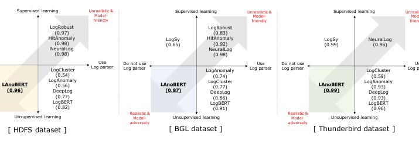

# LAnoBERT: System Log Anomaly Detection based on BERT Masked Language Model

*Yukyung Lee, Jina Kim, Pilsung Kang*

> Source: uploaded paper, arXiv:2111.09564v3 (23 Jul 2023).
## Abstract

The system log generated in a computer system refers to large-scale data that are collected simultaneously and used as the basic data for determining errors, intrusion and abnormal behaviors. The aim of system log anomaly detection is to promptly identify anomalies while minimizing human intervention, which is a critical problem in the industry. Previous studies performed anomaly detection through algorithms after converting various forms of log data into a standardized template using a parser. Particularly, a template corresponding to a specific event should be defined in advance for all the log data using which the information within the log key may get lost. In this study, we propose LAnoBERT, a parser free system log anomaly detection method that uses the BERT model, exhibiting excellent natural language processing performance. The proposed method, LAnoBERT, learns the model through masked language modeling, which is a BERT-based pre-training method, and proceeds with unsupervised learning-based anomaly detection using the masked language modeling loss function per log key during the test process. In addition, we also propose an efficient inference process to establish a practically applicable pipeline to the actual system. Experiments on three well-known log datasets, i.e., HDFS, BGL, and Thunderbird, show that not only did LAnoBERT yield a higher anomaly detection performance compared to unsupervised learning-based benchmark models, but also it resulted in a comparable performance with supervised learning-based benchmark models.
## 1. Introduction

Owing to the recent advancement of the IT industry, a growing emphasis is placed on the importance of the system log data for identifying problems when accidents or failures occur in programs (He et al., 2017). The system log comprises large-scale data collected simultaneously in a computer system and used as the basic data for determining anomalies; thus it is a very critical and valuable resource. The log data generated from various systems should be monitored in real-time for system stability because they represent the current status of a system. Real-time monitoring is conventionally performed by operators; however, such a method entails the possibility of including errors and bias depending on the operator and is limited by being unable to promptly detect system anomalies (Simache & Kaaniche, 2005). Subsequently, anomaly detection using rule-based algorithms has been proposed to reduce human error (Cinque et al., 2013). However, rule-based methodologies also require human intervention; therefore, research is being actively conducted on real-time monitoring-based anomaly detection methods based on machine learning, which minimizes human intervention (Du et al., 2017). Log data are sequence data collected in real-time. They consist of a combination of log keys, which can be considered as words, whereas log sequences can be considered as sentences; a log sequence is generated through a series of syntax rules (Du & Li, 2016). Also, since log data is accumulated based on user actions at regular time intervals, there are many duplicates in an actual log history. Hence, although the total amount of log instances is very large, a single log sequence is short and the number of unique log keys are limited in general. Machine learning-based log anomaly detection involves three steps: 1) preprocessing log keys, 2) feature embedding, and 3) anomaly detection. Preprocessing of log keys refers to refining unstructured log keys and can be performed with or without a log parser. Parsing-based log anomaly detection involves generating log data in a standardized template format using a log parser. Feature embedding involves extracting features from preprocessed log sequences. Recent methods (Nedelkoski et al., 2020) use transformer-based models, whereas earlier methods used RNNs to treat log sequences as natural language (Brown et al., 2018; Du et al., 2017; Kim et al., 2016). Anomaly detection involves finding abnormal logs using the extracted features. Previous log anomaly detection studies (Du et al., 2017; Zhang et al., 2019; Huang et al., 2020; Nedelkoski et al., 2020) showed remarkable performance on open datasets, but have limitations in terms of practicality and extensibility.
- Reliance on Log Parsers: Parser-based log preprocessing requires predefined templates for standardizing log keys and manual refinement by experts (Du & Li, 2016). This method may result in loss of crucial information during standardization (Huang et al., 2020) and its performance becomes dependent on log parser compatibility rather than the logic of anomaly detection models (Nedelkoski et al., 2020).
- Feature embedding with rich semantics for long-term dependency: In the field of log anomaly detection, previous feature embedding methods primarily utilized RNN-based algorithms, which have been successful in natural language processing (Vaswani et al., 2017). However, these algorithms have difficulties in handling long sequences, particularly with regard to modeling long-term dependencies. To address these limitations, current research is exploring the use of transformer-based architecture (Nedelkoski et al., 2020), which has recently demonstrated exceptional performance in natural language processing (Vaswani et al., 2017).
- Unrealistic problem formulation: In prior research, log anomaly detection was mostly formulated as a binary classification instead of anomaly detection (Huang et al., 2020; Nedelkoski et al., 2020; Zhang et al., 2019). However, in practical systems, the majority of logs are normal, with only a small amount of abnormal logs. Formulating log anomaly detection as a binary classification problem requires a sufficient amount of abnormal data for model training, which is unrealistic as abnormal data is rare in real-world systems. Hence, a more practical approach is to train the model using only normal log data and then utilize abnormal data only during testing, better reflecting real-world scenarios. As a solution for the aforementioned problem, this study proposes a new log anomaly detection model (LAnoBERT; Log Anomaly detection based on BERT) established on the following three improvement plans. In LAnoBERT, a simple preprocessing approach utilizing regular expressions was selected to mitigate information loss during the parsing process and to minimize dependence on a specific log parser. Contextualized embedding was extracted using the BERT model, which was trained from scratch to learn the log key sequences, in contrast to previous models which relied on static embedding for feature extraction. Lastly, unsupervised learning-based anomaly detection was performed under the assumption that the context of normal logs differs from that of abnormal logs. In the proposed model, LAnoBERT, masked language modeling of BERT (Devlin et al., 2019) was utilized to perform anomaly detection based on the masking predictive probability. An efficient inference process was also proposed, where a log dictionary database was defined, and log key matching was performed for anomaly detection. The model demonstrated superior performance compared to previous models on benchmark datasets of system logs (HDFS, BGL, and Thunderbird). It showed the best performance among unsupervised learning-based models and comparable performance to supervised learning-based models, despite being trained in a less advantageous environment. LAnoBERT satisfied both detection performance and practicality by outperforming some supervised learning-based models. In summary, the main contributions of our study are as follows.
- We propose LAnoBERT, a new BERT-based unsupervised and log parser-free anomaly detection framework for log data. Unlike previous studies, it is a log parser-free and unsupervised learning-based model.
- To improve efficiency, an inference process utilizing a log dictionary database is proposed to identify abnormal logs. This reduces the computational burden of BERT and handles log sequences with lots of redundant information.
- Despite being trained under less favorable conditions, LAnoBERT demonstrated better or comparable performance to supervised learning-based models. In addition, LAnoBERT effectively detects anomalies in various types of logs, validating its practical usefulness. This paper is organized as follows. In Section 2, previous studies are reviewed by categorizing them based on neural networks with parsing and free of parsing. In Section 3, the background knowledge related to the research is introduced in addition to the log parser and BERT model. Section 4 explains the proposed model, LAnoBERT, and its structure, whereas Section 5 describes the experimental design, and Section 6 describes the log anomaly detection performance. Lastly, in Section 7, the conclusion of this study and future research subjects are explained.
## 2. Related Work

Log anomaly detection refers to a method for detecting abnormal logs from a large log dataset. Studies in earlier years (Cinque et al., 2013; Hansen & Atkins, 1993; Oprea et al., 2015; Prewett, 2003; Yen et al., 2013) performed anomaly detection by regarding specific parts of log data as abnormal. However, these studies had a critical limitation of requiring professional domain-specific knowledge. Recent methodologies involve extracting log data features using a neural network-based model and performing anomaly detection. Log data are unstructured data with a highly complex structure; thus, log anomaly detection can be divided into parsing-based or parsing-free depending on the preprocessing method for the log data.
### 2.1. Parsing-based log anomaly detection

In these methods, a log parser is needed to perform log anomaly detection. The Drain parser(He et al., 2017), which is the most commonly used parser, classifies log messages based on the length using a decision tree and then allocates a log template by exploring the word similarity. In this process, the similarity between the new log message and the existing log template is calculated, and a new template is allocated for the data with a different format from the existing template. DeepLog (Du et al., 2017) is the first neural network-based log anomaly detection model in which an anomaly is detected using an unsupervised learning-based LSTM model. In the training phase, a log is generated in a standardized template using the Drain parser and then a normal log template pattern is learned. In the test phase, logs having a pattern not trained with the normal data are determined as anomalies. In other words, log patterns with low frequencies are given low scores. The concept of the ‘top g candidate' is introduced to discern log patterns where it is regarded as normal if the log patterns are present within the candidate or abnormal if not present; thus, the performance varies depending on the candidate. LogRobust (Zhang et al., 2019) is an attention-based biLSTM model for detecting anomalies. After creating a log with a standardized template using the Drain parser, the log data features are extracted by generating TF-IDF and a word semantic vector. Because this particular model detects anomalies based on classification, it can be considered as a classification problem. HitAnomaly (Huang et al., 2020) is an anomaly detection model using a transformer. It also conducts preprocessing through the Drain parser. A template is standardized through a log parser and the information substituted with a template is defined as parameters. The substituted information refers to the data that get lost without inclusion in the template. Two types of information are separately encoded using a transformer encoder, and two types of representation are combined based on attention to detect anomalies through classification. This model also performs classification-based anomaly detection, thus entailing limitations. LogBERT (Guo et al., 2021) is a BERT-based framework for log data anomaly detection, utilizing a Drain parser for log sequence refinement. It follows a similar approach to DeepLog in detecting outliers but instead trains using only normal log data through two tasks. The first task, masked log key prediction (MLKP), trains normal log patterns via the same objective function as masked language modeling. The second task, Volume of Hypersphere Minimization (VHM), aims to find the smallest sphere that contains normal logs. In the inference stage, the top g predicted log keys are selected as a candidate set from a randomly masked normal log sequence, and the observed log key is considered as an anomaly if it does not belong to the candidate set. The model detects anomalies by applying BERT's masked language modeling, however, it has a limitation in that it cannot fully consider the log sequence when masking due to the random selection of a log key from the sequence. In this study, we propose a log anomaly detection model that does not depend on the log parser. Therefore, even when a new log sequence is recorded, data is not parsed using the log template, but the log sequence is refined using simple preprocessing logic. This method can preserve the log sequence as much as possible by minimizing information loss commonly occurred in the parsing process.
### 2.2. Parsing-free log anomaly detection

LogSy (Nedelkoski et al., 2020) is a transformer-based anomaly detection model that uses a tokenizer to preprocess log values; thus, it is free from the use of a log parser when detecting anomalies. In LogSy, classification is performed using normal data of a training log and abnormal log data generated from a different system. In addition, training is performed so that the distance between the normal and abnormal log increases through a distance-based loss function. It is different from LogRobust and HitAnomaly because it does not learn the normal and abnormal log generated in one system based on classification like the previous models. Hence, this model also entails various limitations to be used in the industry as it adapts a classification-based approach. Additionally, NeuralLog (Le & Zhang, 2021) is also a parser-free and classification-based anomaly detection model. While NeuralLog shares a similar structure with LogSy, it distinguishes itself by employing both normal and abnormal data from the target system, as well as a separate system, during the training process. In contrast, LogSy addresses the classification problem by relying solely on normal data from the target system and abnormal data generated from a different system. The proposed model is also a log parser-free methodology. After refining the log through a simple preprocessing logic, the log sequence is segmented using a word-piece tokenizer. Through this, the log sequence is not categorized into one of the predefined templates, but the log sequence itself is used as an input of the anomaly detection model. Also, it can be flexibly applied even if a new log sequence that has not been processed ever.
## 3. Background

### 3.1. Log parser for anomaly detection

Log data are large-scale data collected in real-time, and raw log messages are usually unstructured because developers are allowed to write free-text log messages in the source code (He et al., 2017). Therefore, a log sequence is unstructured data that must be converted to structured data. A log parser (Du & Li, 2016; He et al., 2017) is a technique proposed for this process. When a standardized log template is generated from an actual log, highly complicated data are simply preprocessed for substitution with very few events. For example, 4,747,964 log messages generated from the BGL system are converted to 376 events through the Drain parser (He et al., 2017). Then, when anomaly detection is performed with preprocessed data, the anomalies can be detected through a simple process. However, the performance of log anomaly detection models using a parser becomes heavily dependent on a log parser (Nedelkoski et al., 2020).
### 3.2. BERT

BERT (Devlin et al., 2019) is a model consisting of a transformer (Vaswani et al., 2017) encoder, which achieved outstanding performance in various natural language processing tasks (Devlin et al., 2019). One of the major characteristics of BERT is that pre-training is performed using two unsupervised learning methods, which are masked language modeling (MLM) and next sentence prediction (NSP). MLM involves replacing certain tokens of an input sentence with ‘[MASK]' and predicting that they would appear in the corresponding position. NSP involves combining two sentences with the token ‘[SEP]' in between, and then predicting whether the two sentences are semantically connected through the ‘[CLS]' token positioned in the very front of the input sentence. These two tasks do not require labeled data as in a specific downstream task; thus, general-purpose knowledge can be sufficiently learned through pre-training using a massive unlabeled dataset (Clark et al., 2019; Jawahar et al., 2019; Tenney et al., 2019). BERT that has been pre-trained is being applied in fields using sequence data in addition to natural language processing; some of the examples include ProtTrans (Elnaggar et al., 2021) and ESM (Rao et al., 2020).
### 3.3. BERT for anomaly detection

The system log can be deemed as sequence data because it is a dataset with an order. Therefore, previous methodologies applied the techniques used for natural language processing to extract the features of logs. The system log data encompass both log messages and natural language. In this study, we propose a BERT-based system log anomaly detection system to overcome the limitations of existing methodologies. Previous methodologies treated all log data as sequence data, but applying BERT enables the learning of both the log features and natural language. Moreover, a tokenizer of BERT can be applied without using a separate log parser during which natural language data that are lost while converting to a template using a log parser can be preserved. Additionally, a model capable of capturing the semantics and context of the system log is necessary for accurately detecting abnormal logs in the system log. It is crucial to capture the semantics and context of the system log because the words appearing in the system log may have a different meaning from natural language. The goal of this research is to implement an effective pre-training approach for the system log utilizing masked language modeling in a bi-directional context. Additionally, we present a novel framework for identifying context anomalies by means of the trained models' MLM loss and predictive probability, along with a log key matching technique during the inference stage.
## 4. Proposed Method

In this chapter, the major network used in the proposed methodology and the architecture of the proposed model are explained. The description and significance of the MLM of BERT are presented in Section 4.1, and the training purpose and execution procedure of the proposed model are presented in Section 4.2 and 4.3, respectively.
### 4.1. Masked Language Model

The operation mechanism of LAnoBERT proposed in this study is shown in Figure 1. Because LAnoBERT is executed through MLM, which is a pre-training method of BERT, MLM is explained in detail in this section, and the log anomaly detection procedure is explained in depth in Section 4.2. MLM was inspired by the cloze task (Taylor, 1953) where certain tokens of an input sentence are replaced with [MASK] and then the words in the [MASK] tokens are predicted. Entire sentences are replaced with the [MASK] token at an arbitrary probability of 15%, and appropriate words can be predicted only based on the context.



**Figure 1.** The architecture of LAnoBERT.

 the MLM objective function can generate bidirectional representations, unlike the pre-training of left-to-right language models. Therefore, the proposed method can pre-train the deep bidirectional transformer (Devlin et al., 2019). According to XLNet (Yang et al., 2019), MLM can be defined as an auto-encoding (AE) pre-training object. When n is the sequence length and the i-th token is xi, the given input sequence can be expressed as X = [x1, x2, ..., xn]. If the [MASK] token is defined as x̄ = [MASK] , the input sequence containing noise can be expressed as X̂ = [x1, [MASK], ..., xn]. In BERT, specific tokens are substituted with the special token [MASK] at a pre-determined probability (15%). Here, the likelihood and objective function can be expressed as follows.

$$
p(\bar{X}\mid\hat{X}) \approx \prod_{n=1}^{N} p(x_n\mid\hat{X})\tag{1}
$$
$$
\begin{aligned}
\max_{\theta}\log p(\bar{x}\mid\hat{X})
&\approx \sum_{n=1}^{N} m_n\log p_{\theta}(x_n\mid\hat{X})\\
&= \sum_{n=1}^{N} m_n\log \frac{\exp\left(H_{\theta}(\hat{x}_n^{\top}e(x_n))\right)}{\sum_{x'}\exp\left(H_{\theta}(\hat{x}_n^{\top}e(x'))\right)} p_{\theta}(x_n\mid\hat{X})
\end{aligned}\tag{2}
$$

In Eq. (2), mn indicates masking, where xn is the [MASK] token when mn = 1. Furthermore, Hθ indicates the hidden vector of a transformer encoder. In this study, MLM was not only applied in the training phase but also in anomaly detection to detect abnormal logs. The reasons for using MLM in system log anomaly detection are as follows. First, there is ample data available for training BERT because the log data are collected in real-time. Most of the collected data are normal log data, which facilitates the effective pre-training of BERT. When a sufficient number of data is given, BERT can obtain numerous contextual and structural features during pre-training. Therefore, performing anomaly detection using the proposed model is expected to improve the generalization performance of effectively detecting abnormal logs by adequately learning the features of a normal log system. Second, MLM does not require the labeling of tasks and accords with the purpose of anomaly detection where only normal data are used for training. Because anomaly detection is an unsupervised learning-based methodology where only normal data are used for training, it is appropriate for application to cases where normal data are predominantly greater than abnormal data. Since anomaly detection is an unsupervised learning-based approach that does not use label information during the model training, it is more appropriate than a supervised binary classification-based approach where there is an overwhelming amount of normal data. Third, MLM is an appropriate methodology to apply to anomaly detection from the perspective of prompt-based learning (Raffel et al., 2020; Petroni et al., 2019; Liu et al., 2021; Radford et al., 2019; Schick & Schütze, 2021). In contrast to conventional methods that require layers conforming to tasks to perform downstream tasks, it is suitable for finding patterns of log data in anomaly detection by comparing the actual log keys and the generated log keys. Fourth, the context of abnormal log data can be identified if MLM is performed using only normal log data. Normal log data have a very similar form as abnormal log data, but the probability of certain words appearing varies if the context of surrounding words is considered. It was assumed that the MLM predictive probability of abnormal log data is low when anomaly detection is performed using the BERT model trained only with normal log data, and the performance result was relevant.
### 4.2. Problem Definition

The system log anomaly detection in this study can be defined as follows. When slen is the sequence length, the log key of the i-th token is wi (wi : wi ∈ V, i = 1, 2, ..., slen), and an individual log sequence is l = (w1, w2, ..., wslen ). Also mask token is defined ¯ l = [MASK]. The goal of the proposed model f is to determine whether the input log sequence is a normal or abnormal log. The log sequence used during training consists of up to slen number of log keys, and a unique set of log keys is defined as V. The log sequences used for training are all normal logs.
**Input Representation.** The input log sequence is defined as
l, and the BERT model is used. Accordingly, the input data used in the train and test phases are configured as follows.
- Train phase : [CLS], w1, [MASK], w3, · · · , [SEP]
- Test phase : [CLS], w1, [MASK], w3, · · · , [SEP] * slen-times In the train phase, the existing log keys were substituted with the [MASK] token at an arbitrary probability; masking was conducted in this study at 20%. In the test phase, masking was not performed at an arbitrary probability; however, each log key was replaced with the [MASK] token when one log sequence was given to generate an slen number of data for the test. **Objective Function.** The objective function used for training is as follows, which is identical to Eq. (2). mi indicates masking, where wi is the [MASK] token when mi = 1. Furthermore, Hθ indicates the hidden vector of a transformer encoder.

$$
\begin{aligned}
\max_{\theta}\log p(\bar{l}\mid\hat{l})
&\approx \sum_{i=1}^{s_{len}} m_i\log p_{\theta}(w_i\mid\hat{l})\\
&= \sum_{i=1}^{s_{len}} m_i\log \frac{\exp\left(H_{\theta}(\hat{l}_i^{\top}e(w_i))\right)}{\sum_{w'}\exp\left(H_{\theta}(\hat{l}_i^{\top}e(w'))\right)} p_{\theta}(w_i\mid\hat{l})
\end{aligned}\tag{3}
$$

### 4.3. LAnoBERT

#### 4.3.1. OVERVIEW

LAnoBERT proposed in this study can be largely divided into the following three parts: preprocessing, model training, and abnormal score computation. First, the minimum preprocessing of a log sequence was performed in the preprocessing step. Numbers, IPs, and dates are preprocessed, and information loss was minimized using regular expressions. An initialized BERT was used as the model. During the training process, MLM was performed using only normal logs, and masking was randomly performed at 20%. The NSP objective function was not used in this study when training BERT. Recent studies have pointed out that the NSP objective function interferes with the performance improvement (Joshi et al., 2020; Lample & Conneau, 2019; Liu et al., 2019; Yang et al., 2019), and it was excluded as it was unnecessary in log anomaly detection. Abnormal scores were calculated from the BERT model, which had been trained using both normal and abnormal logs during test.
#### 4.3.2. PREPROCESSING

Because this study adopted a log parser-free method, simple preprocessing is conducted using regular expressions. As shown in Figure 3, the original log is highly complicated, unstructured data. When the Drain parser is used (with a log parser), the parts defined as a template are excluded and eliminated, whereas certain parts are replaced with 〈*〉. Conversely, this study did not use a log parser and instead replaced the data with clear formats such as numbers, dates, and IPs with the words ‘NUM' or ‘IP'. Preprocessed log sequences were tokenized using the WordPiece (Wu et al., 2016) model used in BERT. The tokenizer for the log data was also trained from scratch to ensure that the vocabulary of the log data from each system could be learned. The training was performed only for the normal logs, and the tokenizer created in the training process was used as it was during the test.
#### 4.3.3. MODEL

The proposed model LAnoBERT executed anomaly detection based on a BERT Masked language model. The most crucial assumption of this study is that "There is a difference between the context of a normal system log and that of an abnormal system log." In other words, language models trained only with normal log data are expected to exhibit significant errors and low predictive probability when they encounter the context of abnormal logs during the test. The prediction error defined in this study refers to a cross-entropy loss that occurs between the label information and logit value generated when the model predicts [MASK] as a specific token. Additionally, the predictive probability is defined as a value with the highest probability among the words that can appear in the [MASK] token. When the probability of a predicted word is low, the respective context is considered difficult to find in the normal context and is identified as an anomaly. Therefore, the errors and predictive probability calculated in this process can be utilized in anomaly detection. The core assumption of this study is as shown in Figure 2. BERT, which is trained only with


**Figure 2.** Anomaly score distribution difference between normal and abnormal log sequences.



**Figure 3.** Examples of preprocessing system log (HDFS dataset).

normal log data, produces low errors and high predictive probability when performing MLM by receiving normal log data as input because the commonly observed logs with a normal pattern are understood as a familiar context. Contrarily, large errors and low predictive probability are produced when performing MLM by receiving abnormal log data as input. The logs are understood as an unfamiliar context if the patterns that are not found in normal logs are input. Previous studies that performed anomaly detection using a transformer defined anomaly detection as a classification problem or adjusted the embedding space using additional objective functions. However, when a log parser is not used in the system log data where normal and abnormal log data are almost identical, a highly complicated format is exhibited and the unsupervised learning-based performance is substantially reduced (Nedelkoski et al., 2020). In this study, therefore, anomaly detection was performed by reflecting the contextuality of the log data. **Train Phase.** Training is performed using the BERT Masked language model for a log sequence that has been tokenized through a tokenizer trained with normal data. Training is initiated from scratch using the initialized BERT, and the same parameters as the BERT-base-uncased are used for the model. The training parameters are almost identical to those of the original BERT (Devlin et al., 2019); the only difference is that the masking probability is set to 0.2. As an unsupervised learning-based anomaly detection model, training is only performed for normal logs. **Test Phase.** In the test phase, the trained BERT is used to verify the normal and abnormal logs. Unlike the training phase, all log keys present in the log sequence are applied with masking, and the predictive probability and error value are calculated. At this time, the test is performed by the number of log keys for one log sequence. An example of this process is illustrated in Figure 4.
#### 4.3.4. ABNORMAL SCORE

As the most important element of anomaly detection, the final abnormal score of one log sequence is defined as the collection of all abnormal scores calculated in the test phase. Owing to the nature of log keys, normal and abnormal logs exhibit almost similar aspects. Therefore, it is not appropriate to use all values calculated for each log key as the abnormal score. If the values of all the log keys are used as the abnormal score, it may cause confusion in recognizing the scores of the abnormal and normal logs. Accordingly, the values calculated from the Top-k number of log keys were used to compute the abnormal score of a given text log in the proposed LAnoBERT. In this study, k is set to 5. The prediction error proposed in this study and the abnormal score of the predictive probability can be defined as follows. When a log sequence is defined as l = (w1, w2, . . . , wslen ), one sequence is generated by the number of log keys to calculate the predictive probability and prediction error. The tokens are then repeatedly replaced with the [MASK] token each; if the i-th token is [MASK], the sequence can be defined as ˆ l1 = (w1, w2, · · · , wi-1, [MASK], wi+1, wslen ). The number of log sequences used for prediction is identical to the length of the log sequence; thus, the prediction error of the i-th log sequence refers to the error value between the


**Figure 4.** Test phase process of LAnoBERT. The proposed model calculates MASK Loss and Prob for each log key to detect anomalies in one log sequence and obtains anomaly scores by aggregating top-k values.

logit value calculated in ˆ li and the label. Additionally, the predictive probability of the i-th log sequence refers to the maximum predictive probability of the word that belongs to the [MASK] position as an answer in ˆ li. The prediction error and predictive probability, named errori and probi respectively, can be obtained for N number of log sequences. Top k values are selected from the set of calculated prediction errors and predictive probabilities to computer the final abnormal score. The equations for computing the abnormal scores of a test log are shown in Eq. (4) and Eq. (5). The proposed methodology independently computes the abnormal score with regard to the prediction error and the prediction probability to detect anomalies.

$$
\mathrm{abnormal}_{error}=\frac{1}{k}\sum_{i\in \mathrm{Top\text{-}k\ indices}} \mathrm{error}_i\tag{4}
$$

$$
\mathrm{abnormal}_{prob}=\frac{1}{k}\sum_{i\in \mathrm{Top\text{-}k\ indices}} \mathrm{prob}_i\tag{5}
$$
\mathrm{abnormal}_{error}=\frac{1}{k}\sum_{i\in \mathrm{Top\text{-}k\ indices}} \mathrm{error}_i\tag{4}
$$

$$
\mathrm{abnormal}_{prob}=\frac{1}{k}\sum_{i\in \mathrm{Top\text{-}k\ indices}} \mathrm{prob}_i\tag{5}
$$ As mentioned in section 4.3.2, LAnoBERT assumed that the abnormal logs would have a large prediction error or a low prediction probability. The abnormal score calculated from each log key is aggregated through the average of the top k values, which becomes the abnormal score of a log sequence. The larger the abnormalerror, the more likely abnormal a given log sequence, whereas the lower the abnormalprob, the more likely abnormal the log sequence. However, as shown in Figure 4, when calculating the abnormal score by LAnoBERT for all log sequences existing in the test dataset, the number of required computations becomes the total number of log sequences × the length of each log sequence. Therefore, if the above method is applied, the computational cost increases and becomes inefficient not sufficient to be applied in an actual system. Inspired by the fact that information is accumulated very frequently and there are many duplicates in log data, we propose an efficient inference process by removing repeated computations for duplicated log sequences. Since a masked log sequence for ith token is defined as ‘[CLS], w1, w2, · · · , wi-1, [MASK], wi+1, · · · , wslen , [SEP]'. We build a log dictionary database with one log sequence as a key value for the inference process. In this database, the dictionary key is defined as a set of KEY = {key0, key1, key2, · · · , keyn}. Each key has its corresponding abnormalerror and abnormalprob as values: DICT = {key1 : (abnormalerror, abnormalprob), key2 : (abnormalerror, abnormalprob), · · · , keyj : (abnormalerror, abnormalprob)}. Whenever one log data arrives, the log key matching is performed. If the input key is not matched to any of the existing keys in the current log dictionary, the values for the new key are computed through inference, and then the log dictionary is updated. On the other hand, when the input key is matched to one of the log keys in the current dictionary, the stored values are extracted as the abnormal score without an actual inference process. The following process reduces the unnecessary time required for detecting anomalies by inference of duplicate logs multiple times. Therefore, it is effective because it can be applied in a realistic scenario and is expected to be effective in online anomaly detection settings. An example of this inference process is illustrated in Figure 5 and the algorithm of the entire process is shown in Algorithm 1.


**Figure 5.** Inference process for LAnoBERT.

### Algorithm 1. Inference Process

```text
// Definition
KEY : a set of log sequence keys, DICT: the dictionary of the log sequence keys,
slen: the sequence length of a log, d: embedding dimension,
{l_n}^N_{n=1}: an individual log sequence (R^{slen x d}),
LAnoBERT: the proposed model, TOPK: the top-k aggregation functions

// Initialization
KEY <- empty set, DICT <- empty set, j = 0

Input : l_n
Output: abnormal_loss, abnormal_prob

for n = 1 to N do
    // log key matching
    if l_n not in DICT then
        score_loss <- empty set, score_prob <- empty set
        for i = 1 to slen do
            l_{n,i} = [MASK]
            loss_j, prob_j <- LAnoBERT(l_n)
            score_loss <- score_loss union {loss_i}
            score_prob <- score_prob union {prob_i}
        end
        abnormal_loss <- TOPK(score_loss)
        abnormal_prob <- TOPK(score_prob)
        key_j = l_n
        KEY <- KEY union {key_j}
        DICT[key_j] = (abnormal_loss, abnormal_prob)
        j <- j + 1
        return abnormal_loss, abnormal_prob
    else
        abnormal_loss, abnormal_prob <- DICT[l_n]
        return abnormal_loss, abnormal_prob
    end
end
```

## 5. Experimental Setting

### 5.1. Datasets

In this study, HDFS (Xu et al., 2009), BGL (Oliner & Stearley, 2007) Thunderbird (Oliner & Stearley, 2007) were used as the benchmark log datasets for a fair comparison with pre-
### Table 1. Number of logs in each dataset used in LAnoBERT

| Dataset | Type | Train | Test |
|---|---|---:|---:|
| HDFS | normal | 8,712,418 (446,578 blocks) | 2,463,201 (128,483 blocks) |
| HDFS | abnormal | - | 138,410 (16,838 blocks) |
| BGL | normal | 3,496,193 | 903,310 |
| BGL | abnormal | - | 348,460 |
| Thunderbird | normal | 166,371,162 | 41,592,791 |
| Thunderbird | abnormal | - | 3,248,239 |

### 5.2. Benchmark Methods

This section presents the benchmark models used to compare LAnoBERT. The benchmark models were selected according to whether they use a log parser and whether learning is supervised or unsupervised.



**Figure 6.** Benchmark models and LAnoBERT for log anomaly detection.

- **LogRobust** is a supervised learning-based model that utilizes an attention-based bi-LSTM architecture. It uses a specialized log parser to preprocess log data, generating TF-IDF and word semantic vectors. Both normal and abnormal logs are used for classification.
- **HitAnomaly** is a supervised transformer-based model. It uses a specialized log parser to standardize templates and encode the information not included in templates as parameters, then combines features with attention for classification.
- **LogSy** is a supervised transformer-based model that does not require a log parser; log values are preprocessed using a tokenizer. Both normal and abnormal data are used, with a distance-based loss function.
- **NeuralLog** is a transformer-based classification model using a tokenizer. It uses normal and abnormal data from both the target and a different system. Among BERT, GPT2, and RoBERTa backbones evaluated in the study, BERT achieved the highest performance.
- **PCA** is a linear transformation technique that builds a counting matrix for log-sequence frequency and reduces it to a lower-dimensional space to identify abnormal sequences.
- **OCSVM** is a one-class classification model trained using only normal logs and designed to identify a boundary separating most normal data from outliers.
- **iForest** is a tree-based unsupervised method that isolates observations distinct from the remainder through an ensemble of decision trees.
- **LogCluster** is a clustering method for detecting frequently occurring line patterns and abnormal events in textual event logs.
- **DeepLog** is an unsupervised LSTM-based model. A specialized log parser generates the inputs, and the model predicts the next word; an unseen next word is treated as anomalous.
- **LogAnomaly** uses an attention-based LSTM architecture and the template2vec technique to model both sequential and quantitative anomalies in log data.
- **LogBERT** is a BERT-based anomaly detection model that uses MLM and DeepSVDD loss during training. It preprocesses logs with a log parser and identifies anomalous patterns in a candidate set similar to DeepLog.

### 5.3. Evaluation Metrics

The study uses **F1 score**, which depends on the threshold, and **AUROC**, which is threshold-independent, as evaluation metrics. The confusion matrix contains true negative (TN), false positive (FP), false negative (FN), and true positive (TP) cases.

| Actual / Predicted | Normal | Abnormal |
|---|---|---|
| **Normal** | True Negative | False Positive |
| **Abnormal** | False Negative | True Positive |

The F1 score is the harmonic mean of precision and recall:

$$
F1 = 2\cdot\frac{\mathrm{precision}\cdot\mathrm{recall}}{\mathrm{precision}+\mathrm{recall}}
\tag{6}
$$

$$
\mathrm{precision}=\frac{TP}{TP+FP},\qquad
\mathrm{recall}=\frac{TP}{TP+FN}
$$

where TP denotes true positive, FP false positive, and FN false negative.

AUROC is calculated over threshold candidates using the false positive rate (FAR) and true positive rate (TPR). A value closer to 1 indicates better anomaly-detection performance, whereas a random model is closer to 0.5.

Because the model is trained only with normal data, the best F1 threshold cannot be determined in advance. Therefore, for a fair comparison, the best theoretical threshold on the test dataset is used for calculating the benchmark F1 scores. AUROC is additionally reported for LAnoBERT because it is not affected by the choice of threshold. For LogSy, LogCluster, and LogAnomaly, AUROC could not be calculated because official implementation code was unavailable.

## 6. Results

To verify the excellence of the proposed methodology, this study compared a supervised and an unsupervised learning-based anomaly detection model. Moreover, the use of a parser was recorded for comparison because the performance of the log anomaly detection significantly varies depending on the use of a log parser.
### 6.1. Anomaly Detection Performance

Table 3 shows the F1-score for the proposed LAnoBERT model and ten additional models, including both supervised learning-based models (LogSy, LogRobust, and HitAnomaly) and unsupervised learning-based models (PCA, IForest, OCSVM, LogCluster, DeepLog, LogAnomaly, and LogBERT). It is important to note that the performance results for the supervised models were obtained from their respective original studies, whereas the performance of all unsupervised models, except for the proposed LAnoBERT, were obtained from the LogBERT study. As a result, the performance results for LogRobust and HitAnomaly on the Thunderbird dataset, as well as for LogSy on the HDFS dataset, are not reported in this study due to the lack of information in their respective original papers. The results indicate that the performance of the BGL dataset was inferior compared to the HDFS dataset due to its more complex structure, as previously reported in Huang et al. (2020). The performance of LogRobust and HitAnomaly, which are based on supervised learning, was observed to be favorable on the HDFS and BGL datasets. Both models underwent preprocessing utilizing the Drain parser, and HitAnomaly, which utilized parameters that were not part of the log template, demonstrated strong performance on both datasets. These results indicate that information loss during log parsing can have a significant impact on model training. LogSy, which employed a classification model built with normal and abnormal data obtained from different systems, recorded an F1 score of 0.6500 on the BGL dataset and 0.9900 on the Thunderbird dataset. This highlights the advantage of incorporating a more realistic representation of the system into the model, as compared to LogRobust and HitAnomaly. However, the performance of LogSy on the BGL dataset was lower than expected. These results emphasize the limitations of performing log anomaly detection without log parsing on data from a specific system. NeuralLog demonstrated high performance across three datasets - HDFS, BGL, and Thunderbird, with scores of 0.9800, 0.9800, and 0.9600 respectively. This performance was noteworthy, particularly considering that it didn't utilize a parser, yet still outperformed supervised learning-based models such as LogRobust and HitAnomaly. This outcome can be interpreted as a meaningful result in itself. However, a limitation of NeuralLog is its reliance on both normal and abnormal logs during the learning process, which could make it less suitable for real-world scenarios. This point can be identified as a potential shortcoming of the model. In the unsupervised learning models comparison, PCA, iForest, OCSVM, and LogCluster showed lower performance compared to DeepLog, LogAnomaly, and LogBERT which utilized deep learning techniques. Specifically, DeepLog outperformed LogAnomaly, demonstrating the effectiveness of its "top g candidate" logic. LogBERT demonstrated remarkable performance with F1 scores of 0.8232 in HDFS, 0.9083 in BGL, and 0.9664 in Thunderbird, with especially strong results in BGL. These results suggest that the BERT-based LogBERT model effectively captures rich semantics by understanding context-specific information to log data. Furthermore, incorporating MLKP and VHM tasks has been observed to improve the model's ability to detect anomalies. In Section 4.3.4, it was highlighted that BERT's MLM allows for the calculation of both mask loss and probability. In order to evaluate the performance of the proposed LAnoBERT, two abnormal scores were generated using mask loss and probability. The results showed that the predictive loss score led to a performance of 0.9123 in HDFS, 0.6932 in BGL, and 0.5142 in Thunderbird. It was observed that HDFS, with its shorter log sequence length and fewer unique log keys, displayed acceptable detection performance. Conversely, BGL and Thunderbird, characterized by longer log sequence lengths and more complex structures, showed relatively lower performance than other deep learning-based unsupervised models. This can be attributed to the fact that the mask loss calculates the accuracy of word-by-word predictions between the original and predicted log keys, resulting in low loss values only when the log keys are predicted in the correct order. For example, if the ground truth log key is ‘A-B-C-D-E' and the model predicts ‘B-C-D-E-F', the loss value would be high due
### Table 3. F1-score on HDFS, BGL, and Thunderbird

† indicates the performance of benchmark models reported by LogBERT. The highest performance is highlighted in bold and underlined, and the second-best performance is indicated in bold in the paper.

| Learning | Model | Log Parser | HDFS | BGL | Thunderbird |
|---|---|:---:|---:|---:|---:|
| Supervised | LogRobust | O | 0.9700 | 0.8300 | - |
| Supervised | HitAnomaly | O | 0.9800 | 0.9200 | - |
| Supervised | LogSy | X | - | 0.6500 | 0.9900 |
| Supervised | NeuralLog | X | 0.9800 | 0.9800 | 0.9600 |
| Unsupervised | PCA† | O | 0.1112 | 0.1661 | 0.5439 |
| Unsupervised | iForest† | O | 0.6049 | 0.3065 | 0.0329 |
| Unsupervised | OCSVM† | O | 0.0495 | 0.0196 | 0.2548 |
| Unsupervised | LogCluster† | O | 0.5399 | 0.7663 | 0.5961 |
| Unsupervised | DeepLog† | O | 0.7734 | 0.8612 | 0.9308 |
| Unsupervised | LogAnomaly† | O | 0.5619 | 0.7409 | 0.9273 |
| Unsupervised | LogBERT | O | 0.8232 | 0.9083 | 0.9664 |
| Unsupervised | LAnoBERT (Predictive Loss) | X | 0.9123 | 0.6932 | 0.5142 |
| Unsupervised | LAnoBERT (Predictive Prob.) | X | 0.9645 | 0.8749 | 0.9990 |

to the incorrect prediction of all tokens. However, from the perspective of the log sequence, the confidence in the ordered prediction of the keys ‘B-C-D-E' must be considered when evaluating an abnormal score. The previously discussed example highlights the limitations of using the predictive loss score on long and complex data. When the predictive probability was used as the abnormal score, LAnoBERT demonstrated superior performance to all the other models, with HDFS scoring 0.9645, BGL scoring 0.8749, and Thunderbird scoring 0.9990, with the exception of BGL. The results showed that the abnormal score based on the mask probability proposed by LAnoBERT was a critical factor in performance improvement. These results highlight the effectiveness of LAnoBERT, an unsupervised learning-based method, compared to the parser-based supervised learning methodologies LogRobust, HitAnomaly, and LogSy. Despite not using a parser during training, LAnoBERT achieved higher performance than LogRobust and LogSy, while being only 0.0451 lower than HitAnomaly in BGL. This demonstrates the significance of considering context and pre-training of MLM in the design of LAnoBERT for log anomaly detection. Additionally, using predictive probability allows for the detection of cases with unseen normal log data more accurately compared to using predictive loss, making LAnoBERT more practical and useful in real-world applications than benchmark models. Furthermore, it is critical to perform log anomaly detection on actual systems. Since logs are collected in real-time, the majority of log data is comprised of normal logs. As a result, conducting anomaly detection based on binary classification using normal and abnormal log data poses a significant challenge for its practical implementation. Figure 7 illustrates the selected benchmark models of supervised and unsupervised learning, with and without the use of a parser. The first quadrant, which represents the parser-involved supervised case, represents the easiest scenario to ensure the performance of a model, but it is also the most unrealistic. On the other hand, the parser-free unsupervised case in the third quadrant is the most realistic scenario but also the most chal-


**Figure 7.** Comparison with LAnoBERT and four benchmark models in realistic scenarios.

lenging in terms of ensuring the performance of a model. Despite these challenges, the proposed LAnoBERT model in this study showed comparable performance (BGL) to benchmark models under the easiest assumption and even better performance (HDFS, Thunderbird) than some benchmark models in the most difficult scenario. Hence, the LAnoBERT model proposed in this study appears to be a practical model that can be applied in real-world systems. As explained earlier, supervised learning-based models are still proposed for system log anomaly detection. The proposed model achieved better performance than LogSy, which is a supervised learning-based model, and the LogRobust model, which uses a parser and is a supervised learning-based model. LAnoBERT recorded excellent detection performance than certain supervised learning-based baseline models in the most unfair comparison environment. In other words, LAnoBERT is a model trained in the most realistic yet disadvantageous environment and is a robust model exhibiting more outstanding or similar performance compared to other baseline models in the most unrealistic and advantageous environment. Table 4 lists the F1 score and AUROC performance of LAnoBERT. The performance of benchmark models was not measured using AUROC, which is a frequently used evaluation metric in anomaly detection. benchmark models may score highly for the best F1 score to exhibit the best performance; however, they are limited in identifying whether the model has high reliability regardless of the threshold. Therefore, the performances of the two evaluation metrics were determined for LAnoBERT, and the results showed that the F1 score is similar to that of the other models evaluated in a relatively more advantageous environment. By contrast, a high AUROC value closer to 1, which indicates that a model is most idealistic, was obtained. Consequently, even if threshold-dependent detection performance metrics other than the F1 score are used, LAnoBERT can be regarded as a highly reliable system log anomaly detection model with remarkably outstanding performance.
### 6.2. Performance according to the BERT learning

method BERT includes models pre-trained with natural language, and the pre-trained model typically resulted in an excellent performance in various natural language processing tasks. Therefore, a comparative experiment was conducted for LAnoBERT, which was pre-trained with natural language. The proposed LAnoBERT was trained to utilize an initialized BERT model. In order to investigate the impact of the pre-training model and provide a practical alternative for real-world log anomaly detection, we conducted an additional experiment in which the pre-trained BERT model with natural language is employed instead of training BERT from scratch. The results of this experiment are documented in Table 5. When the BERT model pre-trained with natural language was used, MLM was additionally performed after importing the pre-trained model. Pre-training has already been performed with massive natural language data, and thus, it can be interpreted that task adaptive pre-training (Gururangan et al., 2020) was conducted with the log data. Table 5 presents the result of training 6,000 steps with a batch size of 15 per 2080 ti for a total of two 2080 ti's. When the BERT model pre-trained with natural language was used, the F1 score in the BGL data was 0.9020, which was improved by 0.0271 compared to the model trained from scratch; by contrast, the F1 score in the HDFS data was 0.9304, which was decreased by 0.0341 compared to the model trained from scratch. These results indicate that the HDFS data consisting of a very simple log structure have degraded performance when a model that has learned the context of natural language is used. The number of vocabularies in the HDFS dataset after preprocessing is only 200, which is very few for expressing the context of natural
### Table 4. Performance of our model (F1 Score, AUROC)

| Learning | Model | Log Parser | HDFS F1 | HDFS AUROC | BGL F1 | BGL AUROC | Thunderbird F1 | Thunderbird AUROC |
|---|---|:---:|---:|---:|---:|---:|---:|---:|
| Unsupervised | LAnoBERT (Predictive Prob.) | X | 0.9645 | 0.9901 | 0.8749 | 0.9721 | 0.9990 | 0.9520 |

### Table 5. Performance of initialized LAnoBERT and pre-trained LAnoBERT

| Learning | Model | Log Parser | Training | HDFS F1 | HDFS AUROC | BGL F1 | BGL AUROC | Thunderbird F1 | Thunderbird AUROC |
|---|---|:---:|---|---:|---:|---:|---:|---:|---:|
| Unsupervised | LAnoBERT (Predictive Prob.) | X | Initialized | 0.9645 | 0.9901 | 0.8749 | 0.9721 | 0.9990 | 0.9520 |
| Unsupervised | LAnoBERT (Predictive Prob.) | X | pre-trained | 0.9304 | 0.9659 | 0.9020 | 0.9912 | 0.8954 | 0.3505 |

language; hence, the pre-training presumably had a negative effect on anomaly detection. Conversely, BGL data with a relatively more complicated structure has a total of 1,000 vocabularies after preprocessing. This supports the fact that the BGL dataset is a more complicated dataset than HDFS, and there are cases where natural language is included in the log data with this number of vocabularies. Therefore, if appropriate training is performed additionally for a model that has learned the context of natural language, the anomaly detection performance can be improved compared to other models that have not been pre-trained. The experimental results in Table 5 show that the log data containing natural language can have a similar form as human language and that pre-trained BERT can be effectively applied. In conclusion, the results demonstrate that incorporating the LAnoBERT framework with a pre-trained BERT model is a viable alternative.
## 7. Conclusion

This study proposed LAnoBERT, which is an unsupervised learning-based system log anomaly detection model where a parser is not used. The proposed LAnoBERT learned the context of normal log data using MLM, and abnormal logs were detected based on the prediction error and predictive probability during the test. In terms of the nature of the system log, normal and abnormal data have similar characteristics; thus, a new score calculation method is proposed for defining the abnormal score based on the top-k predictive probability. The proposed model exhibited the best performance compared to the unsupervised models, and superior or similar performance compared to supervised learning-based models. In addition, the efficient inference process proposed in this study is expected to work well in an actual system. Although the performances of benchmark models are heavily dependent on the use of log parser, our proposed LAnoBERT can be a robust and parser-independent log anomaly detection model. The proposed LAnoBERT framework exhibits promising results in log anomaly detection, however, there are limitations that need to be addressed in future research. Firstly, LAnoBERT requires individual training for each log dataset. A unified framework, as outlined in UniAD (You et al., 2022), is needed to cater to diverse log structures in different systems like distributed systems, supercomputers, and server applications. Secondly, LAnoBERT's Transformerbased architecture incurs higher computational costs compared to RNN-based models due to its self-attention layer (O(n2 · d) complexity) versus the recurrent layer of RNN (O(n · d2 ) complexity). To resolve the computational inefficiency, incorporating recent parameter-efficient learning methods such as LoRA (Hu et al., 2022) and Adapter (Houlsby et al., 2019) is crucial in developing a real-time log anomaly detection model. Finally, in this study, only minimal preprocessing was performed using regular expressions and tokenization using Wordpiece tokenizer. The Log Parser-free methodology can be improved by templating log sequences into the natural language via prompt tuning (Brown et al., 2020; Lester et al., 2021) which could enable anomaly detection with a pre-trained tokenizer and language model, without the need for further preprocessing or training.
## Acknowledgements

This work was supported by the National Research Foundation of Korea (NRF) grant funded by the Korea government (MSIT) (NRF-2022R1A2C2005455). This work was also supported by Institute of Information & communications Technology Planning & Evaluation (IITP) grant funded by the Korea government (MSIT) (No. 2021-0-00471, Development of Autonomous Control Technology for Error-Free Information Infrastructure Based on Modeling & Optimization).
## References

Brown, A., Tuor, A., Hutchinson, B., and Nichols, N. Recurrent neural network attention mechanisms for interpretable system log anomaly detection. In Proceedings of the First Workshop on Machine Learning for Computing Systems, MLCS'18, pp. 8, New York, NY, USA,
2018. Association for Computing Machinery. ISBN

9781450358651. doi: 10.1145/3217871.3217872. URL

https://doi.org/10.1145/3217871.3217872. Brown, T., Mann, B., Ryder, N., Subbiah, M., Kaplan, J. D., Dhariwal, P., Neelakantan, A., Shyam, P., Sastry, G., Askell, A., Agarwal, S., Herbert-Voss, A., Krueger, G., Henighan, T., Child, R., Ramesh, A., Ziegler, D., Wu, J., Winter, C., Hesse, C., Chen, M., Sigler, E., Litwin, M., Gray, S., Chess, B., Clark, J., Berner, C., McCandlish, S., Radford, A., Sutskever, I., and Amodei, D. Language models are few-shot learners. In Larochelle, H., Ranzato, M., Hadsell, R., Balcan, M., and Lin, H. (eds.), Advances in Neural Information Processing Systems, volume 33, pp. 1877-1901. Curran Associates, Inc.,
2020. URL https://proceedings.neurips.cc/paper/2020/

file/1457c0d6bfcb4967418bfb8ac142f64a-Paper.pdf. Cinque, M., Cotroneo, D., and Pecchia, A. Event logs for the analysis of software failures: A rule-based approach. IEEE Transactions on Software Engineering, 39(6):806821, 2013. doi: 10.1109/TSE.2012.67. Clark, K., Khandelwal, U., Levy, O., and Manning, C. D. What does BERT look at? an analysis of BERT's attention. In Proceedings of the 2019 ACL Workshop BlackboxNLP: Analyzing and Interpreting Neural Networks for NLP, pp. 276-286, Florence, Italy, August 2019. Association for Computational Linguistics. doi: 10.18653/v1/W19-4828. URL https://aclanthology. org/W19-4828. Devlin, J., Chang, M.-W., Lee, K., and Toutanova, K. BERT: Pre-training of deep bidirectional transformers for language understanding. In Proceedings of the 2019 Conference of the North American Chapter of the Association for Computational Linguistics: Human Language Technologies, Volume 1 (Long and Short Papers), pp. 4171-4186, Minneapolis, Minnesota, June
2019. Association for Computational Linguistics. doi:

10.18653/v1/N19-1423. URL https://aclanthology.org/ N19-1423. Du, M. and Li, F. Spell: Streaming parsing of system event logs. In 2016 IEEE 16th International Conference on Data Mining (ICDM), pp. 859-864, 2016. doi: 10.1109/ ICDM.2016.0103. Du, M., Li, F., Zheng, G., and Srikumar, V. Deeplog: Anomaly detection and diagnosis from system logs through deep learning. In Proceedings of the 2017 ACM SIGSAC Conference on Computer and Communications Security, CCS '17, pp. 1285-1298, New York, NY, USA,
2017. Association for Computing Machinery. ISBN

9781450349468. doi: 10.1145/3133956.3134015. URL

https://doi.org/10.1145/3133956.3134015. Elnaggar, A., Heinzinger, M., Dallago, C., Rehawi, G., Yu, W., Jones, L., Gibbs, T., Feher, T., Angerer, C., Steinegger, M., Bhowmik, D., and Rost, B. Prottrans: Towards cracking the language of lifes code through selfsupervised deep learning and high performance computing. IEEE Transactions on Pattern Analysis and Machine Intelligence, pp. 1-1, 2021. doi: 10.1109/TPAMI.2021. 3095381. Guo, H., Yuan, S., and Wu, X. Logbert: Log anomaly detection via bert. In 2021 International Joint Conference on Neural Networks (IJCNN), pp. 1-8, 2021. doi: 10. 1109/IJCNN52387.2021.9534113. Gururangan, S., Marasović, A., Swayamdipta, S., Lo, K., Beltagy, I., Downey, D., and Smith, N. A. Don't stop pre-training: Adapt language models to domains and tasks. In Proceedings of the 58th Annual Meeting of the Association for Computational Linguistics, pp. 83428360, Online, July 2020. Association for Computational Linguistics. doi: 10.18653/v1/2020.acl-main.740. URL https://aclanthology.org/2020.acl-main.740. Hansen, S. E. and Atkins, E. T. Automated system monitoring and notification with swatch. In LISA, volume 93, pp. 145-152, 1993. He, P., Zhu, J., Zheng, Z., and Lyu, M. R. Drain: An online log parsing approach with fixed depth tree. 2017 IEEE International Conference on Web Services (ICWS), pp. 33-40, 2017. Houlsby, N., Giurgiu, A., Jastrzebski, S., Morrone, B., De Laroussilhe, Q., Gesmundo, A., Attariyan, M., and Gelly, S. Parameter-efficient transfer learning for NLP. In Chaudhuri, K. and Salakhutdinov, R. (eds.), Proceedings of the 36th International Conference on Machine Learning, volume 97 of Proceedings of Machine Learning Research, pp. 2790-2799. PMLR, 0915 Jun 2019. URL https://proceedings.mlr.press/v97/ houlsby19a.html. Hu, E. J., yelong shen, Wallis, P., Allen-Zhu, Z., Li, Y., Wang, S., Wang, L., and Chen, W. LoRA: Low-rank adaptation of large language models. In International Conference on Learning Representations, 2022. URL https://openreview.net/forum?id=nZeVKeeFYf9. Huang, S., Liu, Y., Fung, C., He, R., Zhao, Y., Yang, H., and Luan, Z. Hitanomaly: Hierarchical transformers for anomaly detection in system log. IEEE Transactions on Network and Service Management, 17(4):2064-2076, 2020. Jawahar, G., Sagot, B., and Seddah, D. What does BERT learn about the structure of language? In Proceedings of the 57th Annual Meeting of the Association for Computational Linguistics, pp. 3651-3657, Florence, Italy, July 2019. Association for Computational Linguistics. doi: 10.18653/v1/P19-1356. URL https:// aclanthology.org/P19-1356. Joshi, M., Chen, D., Liu, Y., Weld, D. S., Zettlemoyer, L., and Levy, O. Spanbert: Improving pre-training by representing and predicting spans. Transactions of the Association for Computational Linguistics, 8:64-77, 2020. Kim, G., Yi, H., Lee, J., Paek, Y., and Yoon, S. Lstmbased system-call language modeling and robust ensemble method for designing host-based intrusion detection systems. CoRR, abs/1611.01726, 2016. URL http://arxiv.org/abs/1611.01726. Lample, G. and Conneau, A. Cross-lingual language model pre-training. CoRR, abs/1901.07291, 2019. URL http: //arxiv.org/abs/1901.07291. Le, V.-H. and Zhang, H. Log-based anomaly detection without log parsing. In 2021 36th IEEE/ACM International Conference on Automated Software Engineering (ASE), pp. 492-504. IEEE, 2021. Lester, B., Al-Rfou, R., and Constant, N. The power of scale for parameter-efficient prompt tuning. In Proceedings of the 2021 Conference on Empirical Methods in Natural Language Processing, pp. 3045-3059, Online and Punta Cana, Dominican Republic, November 2021. Association for Computational Linguistics. doi: 10.18653/v1/ 2021.emnlp-main.243. URL https://aclanthology.org/ 2021.emnlp-main.243. Lin, Q., Zhang, H., Lou, J.-G., Zhang, Y., and Chen, X. Log clustering based problem identification for online service systems. In 2016 IEEE/ACM 38th International Conference on Software Engineering Companion (ICSE-C), pp. 102-111, 2016. Liu, F. T., Ting, K. M., and Zhou, Z.-H. Isolation forest. In 2008 Eighth IEEE International Conference on Data Mining, pp. 413-422, 2008. doi: 10.1109/ICDM.2008. 17. Liu, P., Yuan, W., Fu, J., Jiang, Z., Hayashi, H., and Neubig, G. Pre-train, prompt, and predict: A systematic survey of prompting methods in natural language processing, 2021. Liu, Y., Ott, M., Goyal, N., Du, J., Joshi, M., Chen, D., Levy, O., Lewis, M., Zettlemoyer, L., and Stoyanov, V. Roberta: A robustly optimized bert pre-training approach. arXiv preprint arXiv:1907.11692, 2019. Meng, W., Liu, Y., Zhu, Y., Zhang, S., Pei, D., Liu, Y., Chen, Y., Zhang, R., Tao, S., Sun, P., and Zhou, R. Loganomaly: Unsupervised detection of sequential and quantitative anomalies in unstructured logs. In Proceedings of the Twenty-Eighth International Joint Conference on Artificial Intelligence, IJCAI-19, pp. 4739-4745. International Joint Conferences on Artificial Intelligence Organization, 7 2019. doi: 10.24963/ijcai.2019/658. URL https://doi.org/10.24963/ijcai.2019/658. Nedelkoski, S., Bogatinovski, J., Acker, A., Cardoso, J., and Kao, O. Self-attentive classification-based anomaly detection in unstructured logs. In 2020 IEEE International Conference on Data Mining (ICDM), pp. 1196-1201. IEEE, 2020. Oliner, A. and Stearley, J. What supercomputers say: A study of five system logs. In 37th Annual IEEE/IFIP International Conference on Dependable Systems and Networks (DSN'07), pp. 575-584. IEEE, 2007. Oprea, A., Li, Z., Yen, T.-F., Chin, S. H., and Alrwais, S. Detection of early-stage enterprise infection by mining large-scale log data. In 2015 45th Annual IEEE/IFIP International Conference on Dependable Systems and Networks, pp. 45-56. IEEE, 2015. Petroni, F., Rocktäschel, T., Riedel, S., Lewis, P., Bakhtin, A., Wu, Y., and Miller, A. Language models as knowledge bases? In Proceedings of the 2019 Conference on Empirical Methods in Natural Language Processing and the 9th International Joint Conference on Natural Language Processing (EMNLP-IJCNLP), pp. 24632473, Hong Kong, China, November 2019. Association for Computational Linguistics. doi: 10.18653/v1/ D19-1250. URL https://aclanthology.org/D19-1250. Prewett, J. E. Analyzing cluster log files using logsurfer. In Proceedings of the 4th Annual Conference on Linux Clusters. Citeseer, 2003. Radford, A., Wu, J., Child, R., Luan, D., Amodei, D., and Sutskever, I. Language models are unsupervised multitask learners. 2019. Raffel, C., Shazeer, N., Roberts, A., Lee, K., Narang, S., Matena, M., Zhou, Y., Li, W., and Liu, P. J. Exploring the limits of transfer learning with a unified text-to-text transformer. Journal of Machine Learning Research, 21(140): 1-67, 2020. URL http://jmlr.org/papers/v21/20-074.html. Rao, R., Meier, J., Sercu, T., Ovchinnikov, S., and Rives, A. Transformer protein language models are unsupervised structure learners. In International Conference on Learning Representations, 2020. Ruff, L., Vandermeulen, R., Goernitz, N., Deecke, L., Siddiqui, S. A., Binder, A., Müller, E., and Kloft, M. Deep one-class classification. In Dy, J. and Krause, A. (eds.), Proceedings of the 35th International Conference on Machine Learning, volume 80 of Proceedings of Machine Learning Research, pp. 4393-4402. PMLR, 1015 Jul 2018. URL https://proceedings.mlr.press/v80/ ruff18a.html. Schick, T. and Schütze, H. Exploiting cloze-questions for few-shot text classification and natural language inference. In Proceedings of the 16th Conference of the European Chapter of the Association for Computational Linguistics: Main Volume, pp. 255-269, Online, April
2021. Association for Computational Linguistics. doi: 10.

18653/v1/2021.eacl-main.20. URL https://aclanthology. org/2021.eacl-main.20. Schölkopf, B., Platt, J. C., Shawe-Taylor, J. C., Smola, A. J., and Williamson, R. C. Estimating the support of a high-dimensional distribution. Neural Comput., 13(7):1443-1471, jul 2001. ISSN 0899-7667. doi: 10.1162/089976601750264965. URL https://doi.org/10. 1162/089976601750264965. Simache, C. and Kaaniche, M. Availability assessment of sunos/solaris unix systems based on syslogd and wtmpx log files: A case study. In 11th Pacific Rim International Symposium on Dependable Computing (PRDC'05), pp. 8 pp.-, 2005. doi: 10.1109/PRDC.2005.20. Taylor, W. L. "cloze procedure": A new tool for measuring readability. Journalism quarterly, 30(4):415-433, 1953. Tenney, I., Das, D., and Pavlick, E. BERT rediscovers the classical NLP pipeline. In Proceedings of the 57th Annual Meeting of the Association for Computational Linguistics, pp. 4593-4601, Florence, Italy, July 2019. Association for Computational Linguistics. doi: 10. 18653/v1/P19-1452. URL https://aclanthology.org/ P19-1452. Vaswani, A., Shazeer, N., Parmar, N., Uszkoreit, J., Jones, L., Gomez, A. N., Kaiser, L. u., and Polosukhin, I. Attention is all you need. In Guyon, I., Luxburg, U. V., Bengio, S., Wallach, H., Fergus, R., Vishwanathan, S., and Garnett, R. (eds.), Advances in Neural Information Processing Systems, volume 30. Curran Associates, Inc., 2017. Wang, Y., Wong, J., and Miner, A. Anomaly intrusion detection using one class svm. In Proceedings from the Fifth Annual IEEE SMC Information Assurance Workshop, 2004., pp. 358-364, 2004. doi: 10.1109/IAW.2004. 1437839. Wu, Y., Schuster, M., Chen, Z., Le, Q. V., Norouzi, M., Macherey, W., Krikun, M., Cao, Y., Gao, Q., Macherey, K., et al. Google's neural machine translation system: Bridging the gap between human and machine translation. arXiv preprint arXiv:1609.08144, 2016. Xu, W., Huang, L., Fox, A., Patterson, D., and Jordan, M. I. Detecting large-scale system problems by mining console logs. In Proceedings of the ACM SIGOPS 22nd symposium on Operating systems principles, pp. 117132, 2009. Yang, Z., Dai, Z., Yang, Y., Carbonell, J., Salakhutdinov, R. R., and Le, Q. V. Xlnet: Generalized autoregressive pre-training for language understanding. Advances in neural information processing systems, 32, 2019. Yen, T.-F., Oprea, A., Onarlioglu, K., Leetham, T., Robertson, W., Juels, A., and Kirda, E. Beehive: Large-scale log analysis for detecting suspicious activity in enterprise networks. In Proceedings of the 29th Annual Computer Security Applications Conference, pp. 199-208, 2013. You, Z., Cui, L., Shen, Y., Yang, K., Lu, X., Zheng, Y., and Le, X. A unified model for multi-class anomaly detection. In Oh, A. H., Agarwal, A., Belgrave, D., and Cho, K. (eds.), Advances in Neural Information Processing Systems, 2022. URL https://openreview.net/forum?id= bMYU8 qD8PW. Zhang, X., Xu, Y., Lin, Q., Qiao, B., Zhang, H., Dang, Y., Xie, C., Yang, X., Cheng, Q., Li, Z., et al. Robust log-based anomaly detection on unstable log data. In Proceedings of the 2019 27th ACM Joint Meeting on European Software Engineering Conference and Symposium on the Foundations of Software Engineering, pp. 807-817, 2019.

---

## Conversion note

This Markdown version is a structural conversion of the uploaded PDF. Figure panels are included as cropped PNGs from the source pages, and mathematical expressions/tables were reconstructed in Markdown/LaTeX where the PDF text extraction did not preserve their original layout. No external sources were used for the conversion.